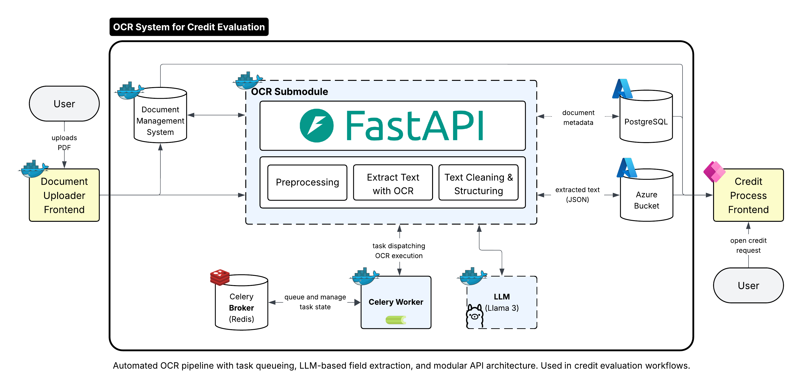

# OCR System for Credit Evaluation

## Executive Summary

The OCR System for Credit Evaluation represents a sophisticated solution that significantly improves credit request processing through intelligent document automation. This advanced system transforms the traditionally manual and error-prone process of extracting information from credit application documents into a streamlined, AI-powered workflow that delivers enhanced accuracy and efficiency. By leveraging advanced Optical Character Recognition (OCR) technology combined with Large Language Model (LLM) intelligence, the system can automatically extract, validate, and structure critical information from complex credit documents including company details, property specifications, financial figures, and loan terms with high precision. The platform's multi-stage processing pipeline ensures data integrity while providing comprehensive audit trails and confidence scoring for every extracted field, enabling financial institutions to make faster, more informed lending decisions while reducing processing time and manual effort. With its modular architecture and containerized deployment, the system offers good scalability and can be integrated into existing credit workflows, providing ROI through reduced manual processing costs, improved accuracy rates, and enhanced customer experience. The solution's ability to handle diverse document formats and adapt to different credit product requirements makes it a valuable asset for banks, credit unions, and financial service providers looking to modernize their lending operations and improve operational efficiency in the competitive fintech landscape.



## Design Log

### Key Assumptions

The system design is built on several foundational assumptions that guide its architecture and capabilities. We assume that credit application documents follow relatively consistent formats and structures, allowing for predictable field extraction patterns. The system assumes that Azure Form Recognizer provides sufficient OCR accuracy for the document types being processed, and that the selected LLM model (Ollama) can effectively interpret and extract structured data from OCR results. We also assume that the processing pipeline can handle the expected document volume without requiring real-time processing guarantees, allowing for asynchronous task processing through Celery.

### Design Tradeoffs

**Accuracy vs. Speed**: The multi-stage processing pipeline prioritizes accuracy over speed, accepting longer processing times in exchange for higher confidence in extracted data. This tradeoff is particularly evident in the LLM extraction phase, where more comprehensive analysis takes precedence over rapid response times.

**Flexibility vs. Complexity**: The system balances document format flexibility with processing complexity. While supporting multiple document types and field mappings increases adaptability, it also introduces complexity in validation rules and field mapping configurations.

**Local vs. Cloud Processing**: The choice of local Ollama deployment for LLM processing prioritizes data privacy and cost control over the scalability and maintenance benefits of cloud-based LLM services. This tradeoff affects deployment complexity and resource requirements.

**Storage Efficiency vs. Audit Trail**: The multi-stage storage approach maintains intermediate processing results for debugging and audit purposes, trading storage efficiency for comprehensive traceability and troubleshooting capabilities.

### System Limitations

**Document Format Dependency**: The system's effectiveness is limited by the quality and consistency of input document formats. Poorly scanned documents, handwritten text, or highly irregular layouts may significantly impact extraction accuracy.

**Language and Regional Constraints**: The current implementation is optimized for German credit documents and may require adaptation for other languages or regional document formats. Field validation rules and business logic are specifically tailored to German financial regulations.

**Processing Scalability**: While the system can handle moderate document volumes, it may face performance bottlenecks under high concurrent load due to the resource-intensive nature of LLM processing and the local deployment model.

**Model Dependency**: Extraction accuracy is directly tied to the quality and training of the underlying LLM model. Changes in model versions or availability could impact system performance and require retraining or adaptation.

**Manual Review Requirements**: Despite automation, the system is designed to flag low-confidence extractions for manual review rather than providing fully autonomous processing, acknowledging the critical nature of financial data accuracy.

## Features

- **Document Processing Pipeline**: Complete OCR to structured data extraction workflow
- **Azure Form Recognizer Integration**: High-accuracy document text extraction
- **LLM-Powered Field Extraction**: Intelligent field identification using Ollama
- **Multi-Stage Storage**: Organized blob storage with processing stages
- **Database Integration**: PostgreSQL for metadata and extracted data storage
- **Task Queue System**: Celery with Redis for scalable processing
- **Visualization**: Document annotation with extracted field overlays
- **Comprehensive Testing**: Full test suite with containerized dependencies

## Planned Enhancements

### Document Preprocessing Pipeline
- **Image Enhancement**: Implement deskewing and rotation correction to ensure optimal document alignment before OCR processing
- **Quality Improvement**: Add sharpening, denoising, and background removal capabilities to enhance document readability and OCR accuracy
- **Digital Text Detection**: Integrate intelligent detection to bypass OCR entirely when documents contain digitally readable text, using direct Python text extraction for improved speed and accuracy

### Local OCR Implementation
- **Vendor Independence**: Replace Azure Form Recognizer with local OCR solutions (e.g., Tesseract, EasyOCR, Docling) to eliminate vendor lock-in and reduce operational costs
- **Offline Processing**: Enable complete offline document processing capabilities for enhanced data privacy and reduced latency

## Architecture

### Core Components

```
src/
├── ocr/                    # OCR processing and Azure integration
│   ├── extraction.py       # Main extraction pipeline
│   ├── azure_ocr_client.py # Azure Form Recognizer client
│   ├── postprocess.py      # OCR result cleaning and normalization
│   └── storage.py          # OCR result storage management
├── llm/                    # Large Language Model integration
│   ├── client.py           # Ollama client for LLM operations
│   └── field_extractor.py  # Field extraction using LLM
├── tasks/                  # Celery task definitions
│   ├── celery_app.py       # Celery application configuration
│   └── pipeline_tasks.py   # Pipeline task implementations
├── creditsystem/           # Credit system specific logic
│   └── storage.py          # Multi-stage blob storage management
├── dms_mock/               # Document Management System mock
│   ├── environment.py      # Test environment setup
│   └── service.py          # DMS service operations
├── visualization/          # Document visualization
└── config.py               # Application configuration
```

### Processing Pipeline

1. **Document Upload** → Raw PDF storage
2. **OCR Processing** → Azure Form Recognizer text extraction
3. **Post-processing** → Text cleaning and normalization
4. **LLM Extraction** → Field identification and extraction
5. **Data Storage** → Structured data saved to database
6. **Visualization** → Annotated document generation

## Technology Stack

- **Python 3.10+**: Core application language
- **Azure Form Recognizer**: Document OCR processing
- **Ollama**: Local LLM for field extraction
- **PostgreSQL**: Metadata and extracted data storage
- **Azure Blob Storage/Azurite**: Document and result storage
- **Celery + Redis**: Task queue and result backend
- **Docker**: Containerized development environment
- **Pytest**: Testing framework with testcontainers

## Prerequisites

- Python 3.10 or higher
- Docker and Docker Compose
- Azure Form Recognizer service (for production)
- Ollama with required models (for LLM processing)

## Quick Start

### 1. Clone and Setup

```bash
git clone <repository-url>
cd credit-ocr-demo-backend
python -m venv .venv
source .venv/bin/activate  # On Windows: .venv\Scripts\activate
pip install -e .
```

### 2. Start Infrastructure Services

```bash
# Start PostgreSQL and Azurite
docker compose up -d

# Initialize database schema
docker compose exec postgres psql -U dms -d dms_meta -f /schema/schema.sql
```

### 3. Configuration

Create your application configuration file:

```hocon
# application.conf
generative_llm {
  url = "http://localhost:11434"
  model_name = "llama3.2:3b"
}

minio {
  endpoint = "localhost:10000"
  access_key = "devstoreaccount1"
  secret_key = "Eby8vdM02xNOcqFlqUwJPLlmEtlCDXJ1OUzFT50uSRZ6IFsuFq2UVErCz4I6tq/K1SZFPTOtr/KBHBeksoGMGw=="
  secure = false
  bucket = "credit-docs"
  region = "us-east-1"
}
```

### 4. Start Ollama (for LLM processing)

```bash
# Install and start Ollama
curl -fsSL https://ollama.ai/install.sh | sh
ollama serve

# Pull required model
ollama pull llama3.2:3b
```

### 5. Start the API Server

You have several options to start the API server:

#### Option A: Using the shell script (recommended)
```bash
# Start on default port 8000
./start.sh

# Start on custom port
./start.sh 8080
```

#### Option B: Using the Python script directly
```bash
# Start from project root
python run.py

# Start from src directory
python src/main.py
```

#### Option C: Using uvicorn directly
```bash
# Start with default settings
uvicorn src.api.main:app --host 0.0.0.0 --port 8000

# Start with reload for development
uvicorn src.api.main:app --host 0.0.0.0 --port 8000 --reload
```

#### Environment Variables
You can customize the server behavior with environment variables:
```bash
export HOST=0.0.0.0
export PORT=8000
export RELOAD=false
export ENVIRONMENT=development
```

### 6. Access the API

Once started, the API will be available at:
- **API Base URL**: http://localhost:8000
- **Health Check**: http://localhost:8000/health
- **API Documentation**: http://localhost:8000/docs
- **Alternative Docs**: http://localhost:8000/redoc

### 7. Run Tests

```bash
# Run all tests with optimized test runner
./run_tests.py

# Or run specific test categories
pytest tests/test_dms_mock.py      # DMS mock tests (no Ollama needed)
pytest tests/test_field_extraction.py  # LLM tests
```

## 🔧 Development Setup

### Container Management

The project uses meaningful container names for easy identification:

- **postgres**: PostgreSQL database
- **azurite**: Azure Blob Storage emulator
- **ollama**: LLM service (in test environment)
- **redis**: Task queue backend (in test environment)

### Test Categories

- **DMS Mock Tests**: PostgreSQL and Azurite integration
- **LLM Tests**: Ollama and field extraction functionality
- **Unit Tests**: Core functionality without external dependencies

### Running Tests

```bash
# Optimized test runner with proper cleanup
./run_tests.py

# Manual test execution
pytest tests/ -v

# With coverage
pytest --cov=src tests/

# Specific test patterns
pytest "tests/test_*_mock.py"
```

## Document Processing

### Supported Document Types

Currently supports **credit request** documents with the following fields:

- Company information (name, legal form, founding date, address)
- Property details (type, name, address, construction year, area)
- Financial information (purchase price, requested amount, equity share)
- Loan terms (amount, term, monthly payment, interest rate)
- Additional details (purpose, early repayment, public funding)

### Field Extraction Process

1. **OCR Processing**: Azure Form Recognizer extracts text and layout
2. **Text Normalization**: Cleaning and standardizing extracted text
3. **LLM Analysis**: Using Ollama to identify and extract specific fields
4. **Validation**: Applying business rules and data validation
5. **Storage**: Saving structured data with confidence scores

## API Usage

### Document Processing Pipeline

```python
from src.ocr.extraction import trigger_extraction, perform_ocr, postprocess_ocr
from src.llm.field_extractor import run_llm_extraction
from src.visualization import generate_visualization

# Start extraction pipeline
document_id = "your-document-id"
job_id = trigger_extraction(document_id)

# Run OCR
ocr_results = perform_ocr(document_id)

# Post-process OCR results
cleaned_results = postprocess_ocr(document_id)

# Extract fields using LLM
extracted_fields = await run_llm_extraction(document_id)

# Generate visualization
visualization_path = generate_visualization(document_id)
```

### Storage Operations

```python
from src.creditsystem.storage import get_storage, Stage

storage = get_storage()

# Download document from specific stage
raw_pdf = storage.download_blob(document_id, Stage.RAW, ".pdf")
ocr_results = storage.download_blob(document_id, Stage.OCR_CLEAN, ".json")
```

## Testing

### Test Environment

The project includes a comprehensive test environment with:

- **Session-scoped containers**: Efficient test execution
- **Automatic cleanup**: Proper resource management
- **Isolated test categories**: Run only what you need
- **Mock services**: DMS and storage emulation

### Running Tests

```bash
# Complete test suite
./run_tests.py

# Specific test files
pytest tests/test_extraction.py
pytest tests/test_field_extraction.py

# With verbose output
pytest -v tests/

# With coverage reporting
pytest --cov=src --cov-report=html tests/
```

## Project Structure

```
credit-ocr-demo-backend/
├── src/                    # Source code
│   ├── ocr/               # OCR processing
│   ├── llm/               # LLM integration
│   ├── tasks/             # Celery tasks
│   ├── creditsystem/      # Credit system logic
│   ├── dms_mock/          # DMS mock services
│   ├── visualization/     # Document visualization
│   └── config.py          # Configuration management
├── tests/                 # Test suite
│   ├── environment/       # Test environment setup
│   ├── resources/         # Test resources
│   └── test_*.py          # Test modules
├── config/                # Configuration files
│   └── document_types.conf # Document type definitions
├── docs/                  # Documentation
├── data/                  # Data files and models
├── docker-compose.yml     # Infrastructure services
├── schema.sql            # Database schema
└── pyproject.toml        # Project configuration
```

## Configuration

### Environment Variables

- `AZURE_STORAGE_CONNECTION_STRING`: Azure Blob Storage connection
- `POSTGRES_HOST`, `POSTGRES_PORT`, `POSTGRES_DB`, `POSTGRES_USER`, `POSTGRES_PASSWORD`: Database configuration
- `OLLAMA_BASE_URL`: Ollama service URL
- `CELERY_BROKER_URL`: Celery broker configuration

### Document Type Configuration

Document types and field mappings are defined in `config/document_types.conf`:

```json
{
  "credit_request": {
    "name": "Kreditantrag",
    "expected_fields": ["company_name", "legal_form", ...],
    "field_descriptions": {...},
    "field_mappings": {...},
    "validation_rules": {...}
  }
}
```

## Deployment

### Production Setup

1. **Azure Services**: Configure Azure Form Recognizer and Blob Storage
2. **Database**: Set up PostgreSQL instance
3. **LLM Service**: Deploy Ollama or use cloud LLM service
4. **Task Queue**: Configure Redis for Celery
5. **Environment**: Set production environment variables

### Docker Deployment

```bash
# Build and run with Docker Compose
docker compose -f docker-compose.prod.yml up -d
```